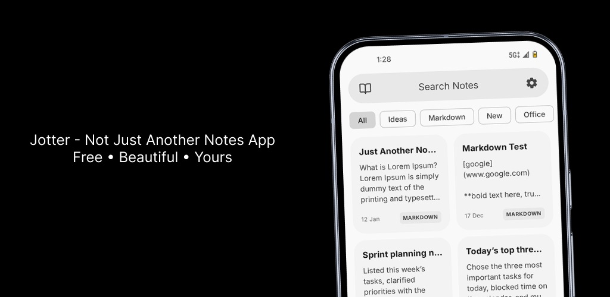
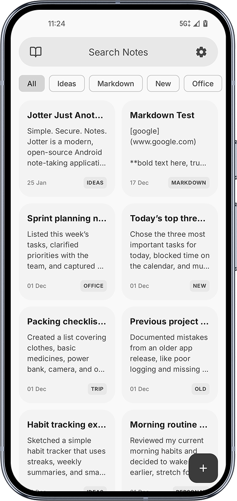
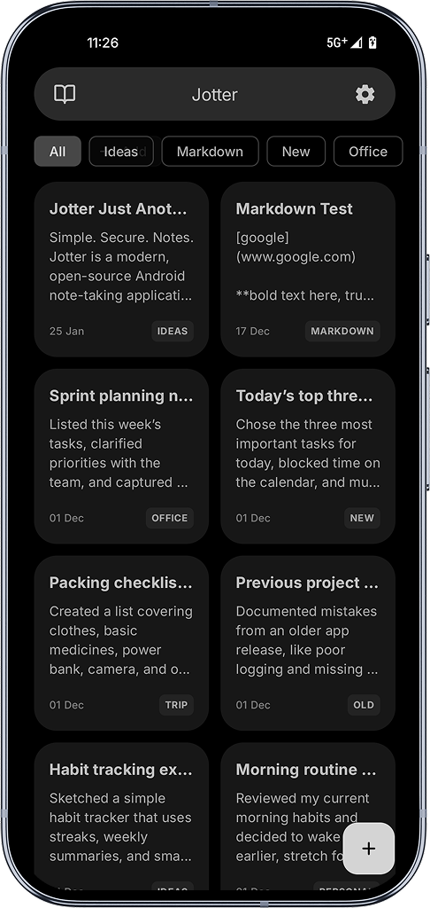
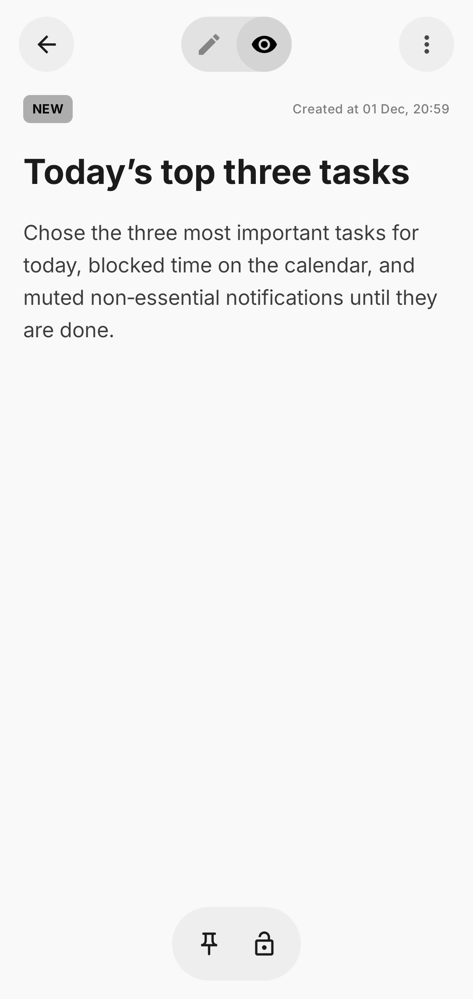
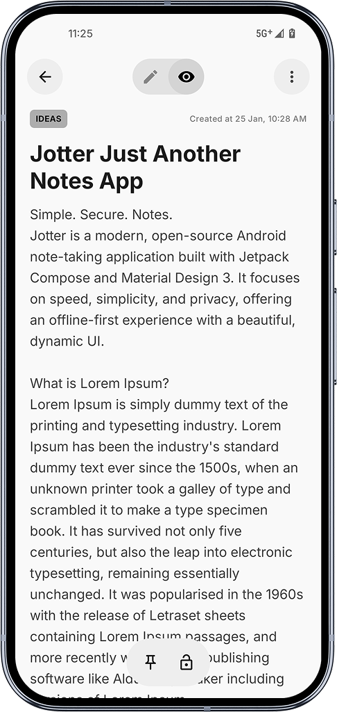
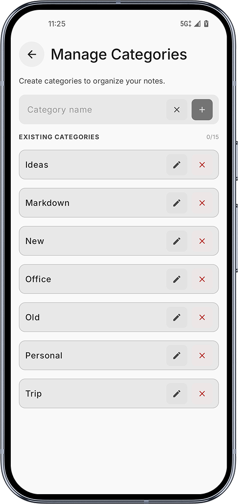
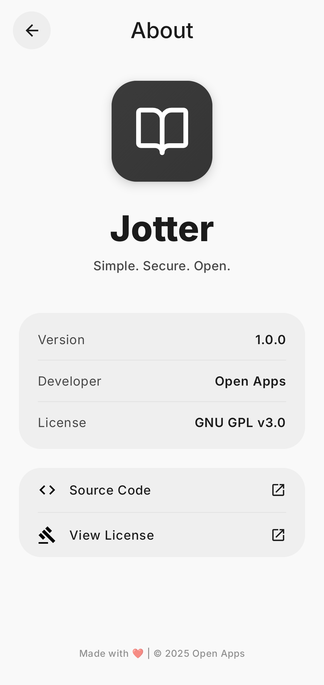
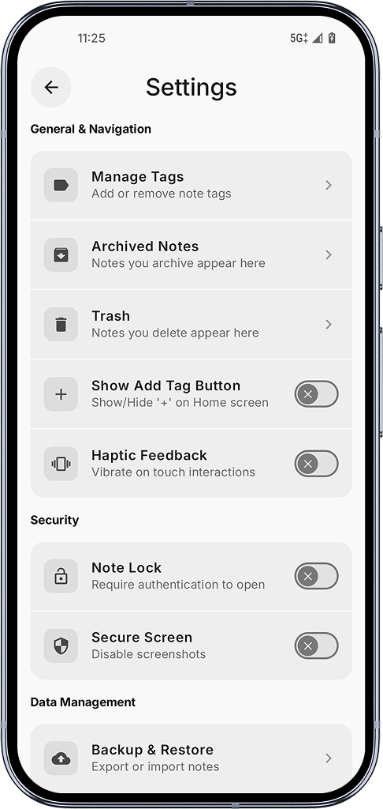
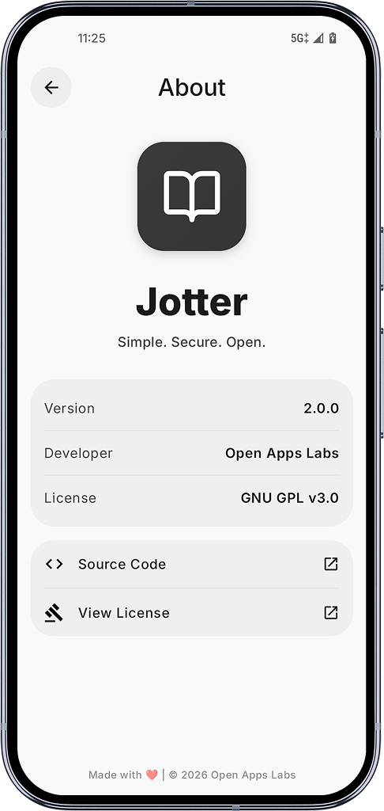

<h1 align="center">Jotter</h1>

    

  
  
  
  
  

Jotter is a modern, free notes app with a sleek, beautiful design. Unlike others loaded with ads and extras, it focuses purely on speed, simplicity, and privacy—offline-first with a dynamic UI that feels effortless. No distractions. No tracking. Just your notes, fast, secure, and only yours.

---

## 📥 Download

Get the latest version of **Jotter**:

  
  
 
  
  

---

## 📱 Screenshots

  
  

  
  

  
  

  
  

## ✨ Features

* **Material You Design:** Fully compatible with Material 3 dynamic theming.  
* **Rich Note Taking:** Create and edit notes seamlessly.  
* **Offline First:** All data is stored locally using Room Database.  
* **Dark Mode & True Dark Mode:** Fully optimized dark theme support.  
* **Lock Notes:** Secure individual notes with a PIN or pattern.  
* **Import & Export Notes:** Backup and restore your notes easily.  
* **Dynamic Colors:** App adapts to your system colors.  
* **Trash & Archive:** Organize your notes without losing data.  
* **Haptics Feedback:** Subtle feedback for interactions.  
* **Multiple View Modes:** List, grid, or compact views for your notes.  

---

## 🤝 Contributing

We welcome contributions! To keep the project organized and maintainable, please follow these guidelines:

1. **Fork the repository** and create a branch
2. **Work on a single feature or fix per branch/PR.** Avoid mixing multiple features or unrelated changes in one Pull Request.
3. **Write clear commit messages**
4. **Ensure code quality:** Follow Kotlin coding conventions and Compose best practices.
5. **Test your changes locally** before submitting.
6. **Open a Pull Request** against the main branch of this repository. Include a description of your changes and any relevant screenshots or notes.

## 🐛 Bug Reporting

If you encounter any bugs, issues, or unexpected behavior while using Jotter, please feel free to [open an issue](https://github.com/yourusername/jotter/issues) on this repository.  

When reporting a bug, please include:

- Steps to reproduce the issue
- Device/Android version
- Screenshots (if applicable)

This helps me fix problems faster and improve the app for everyone.
I welcome all constructive feedback and suggestions.
This app is still in progress.

If you find Jotter useful, please consider ⭐ starring the repository to help others discover it.

## 📄 License

Jotter is licensed under the [GNU GPL v3.0](https://www.gnu.org/licenses/gpl-3.0.en.html).
