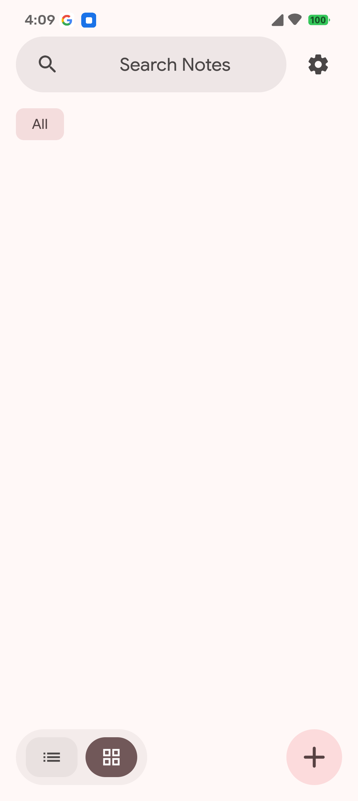
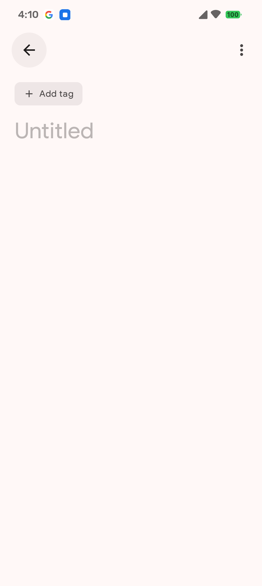
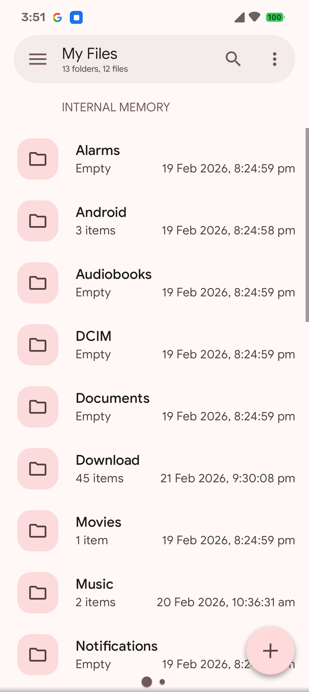
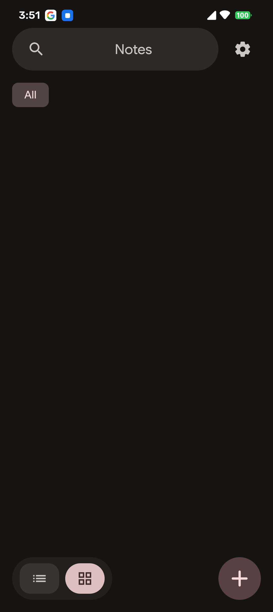
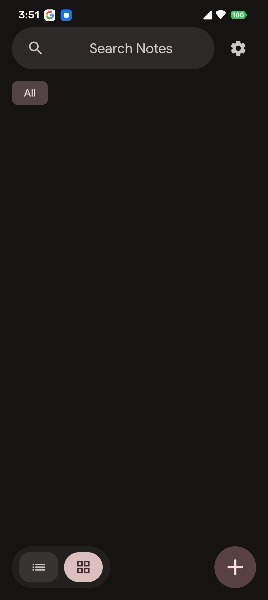
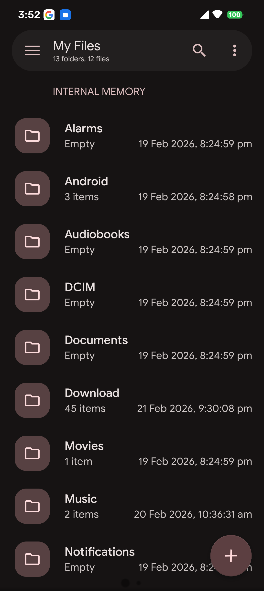

# Notes

A modern, privacy-focused note-taking app for Android with Material 3 Expressive UI.

## Features

- **Material 3 Expressive Design** - Modern UI with dynamic color theming (Monet)
- **Privacy First** - All data stored locally, no cloud sync, no accounts required
- **Dark Mode** - Full dark theme support with optional true black mode
- **Note Organization** - Categories/tags, pinning, and search
- **Lock Notes** - Secure notes with biometric authentication
- **Archive & Trash** - Organize notes with archive and trash functionality
- **Backup & Restore** - Export and import your notes

## Screenshots

### Light Mode

| Home Screen | Note Editor | Settings |
|:-----------:|:-----------:|:--------:|
|  |  |  |

### Dark Mode

| Home Screen | Note Editor | Settings |
|:-----------:|:-----------:|:--------:|
|  |  |  |

## Download

Download the latest APK from [Releases](https://github.com/TheGreatApollyon/notes/releases).

## Tech Stack

- **Kotlin** - Modern Android development
- **Jetpack Compose** - Declarative UI
- **Material 3** - Latest design system
- **Hilt** - Dependency injection
- **Room** - Local database
- **DataStore** - Preferences

## Building

1. Clone the repository:
   ```bash
   git clone https://github.com/TheGreatApollyon/notes.git
   cd notes
   ```

2. Open in Android Studio or build from command line:
   ```bash
   ./gradlew assembleDebug
   ```

## License

```
Notes - A privacy-focused note-taking app for Android
Copyright (C) 2026 Forvia

This program is free software: you can redistribute it and/or modify
it under the terms of the GNU General Public License as published by
the Free Software Foundation, either version 3 of the License, or
(at your option) any later version.

This program is distributed in the hope that it will be useful,
but WITHOUT ANY WARRANTY; without even the implied warranty of
MERCHANTABILITY or FITNESS FOR A PARTICULAR PURPOSE.  See the
GNU General Public License for more details.

You should have received a copy of the GNU General Public License
along with this program.  If not, see <https://www.gnu.org/licenses/>.
```

## Privacy

Notes stores all data locally on your device. No accounts, no cloud sync, no data collection. Your notes remain private and under your control.

- No third-party analytics or advertising
- No information is ever shared with external services
- All notes are stored in a local SQLite database

## Contributing

Contributions are welcome! Please feel free to submit a Pull Request.

1. Fork the repository
2. Create your feature branch (`git checkout -b feature/AmazingFeature`)
3. Commit your changes (`git commit -m 'Add some AmazingFeature'`)
4. Push to the branch (`git push origin feature/AmazingFeature`)
5. Open a Pull Request
